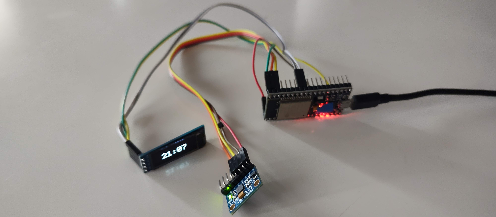
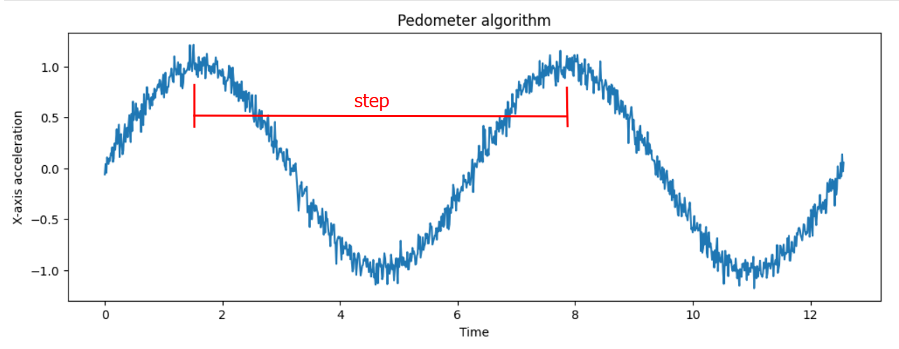
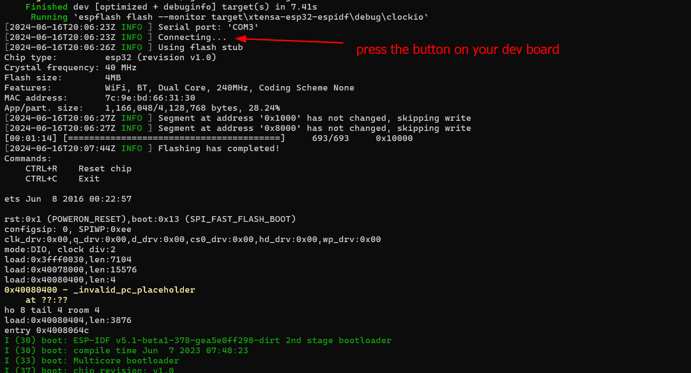

# pedometer-rust-esp32
Some time ago, I started running and my partner gave me a smart watch that allows me to measure my workouts. From the very beginning, I was intrigued by the algorithm for counting steps (pedometer). So, I bought an accelerometer and tried to replicate it, using an ESP32 and an OLED display that I already had.

In an attempt to replicate the behavior of the watch, this implementation connects to WiFi, updates the time via NTP, and then counts steps by analyzing the accelerometer signal. Then it displays the current time and the steps, cycling between them.

## Counting the steps

I only used the information from the X-axis because it's enough. Basically, samples are taken every 100 milliseconds, and it tries to detect when the data changes its upward or downward trend, attempting to find the inflection points. From one peak to another, we assume a step has been taken. Therefore, we can deduce the steps by counting the number of "peaks".

## Demo video

Here you can find a live demonstration:  [Realtime demo - YouTube video](https://youtu.be/qpRlkYwzalA)

## Installing dev environment

The reference is https://docs.esp-rs.org/book/installation/index.html

* Install Rust compiler and toolchain with `rustup` https://rustup.rs/
* (Windows only) Install C++ Development tools from https://visualstudio.microsoft.com/it/visual-cpp-build-tools/ 
* Install the ESP32 things executing `cargo install espup`
* Then execute `espup install`
* More dependencies: execute `cargo install ldproxy`
* Install Python, I chose 3.10 https://www.python.org/downloads/release/python-3109/
* Install `git` if you don't already have it https://www.git-scm.com/downloads
* Execute `cargo install cargo-generate` and `cargo install espflash`

For initiating a new project you do:
* `cargo generate esp-rs/esp-idf-template cargo` and answer the questions
* `cargo build` should compile the source code generated
* in my case I should add `ESP_IDF_PATH_ISSUES = 'warn'` into the `env` section of `.cargo\config.toml`
* also I needed the "CP210x USB to UART Bridge VCP Drivers" from https://www.silabs.com/developers/usb-to-uart-bridge-vcp-drivers?tab=downloads

Remember that you should enable the board flashing by pressing a button on your dev board. I can't provide further details because it depends on your board. There are a lot of versions in the wild.

The flash utility creates an output like this when you do `cargo run`:

